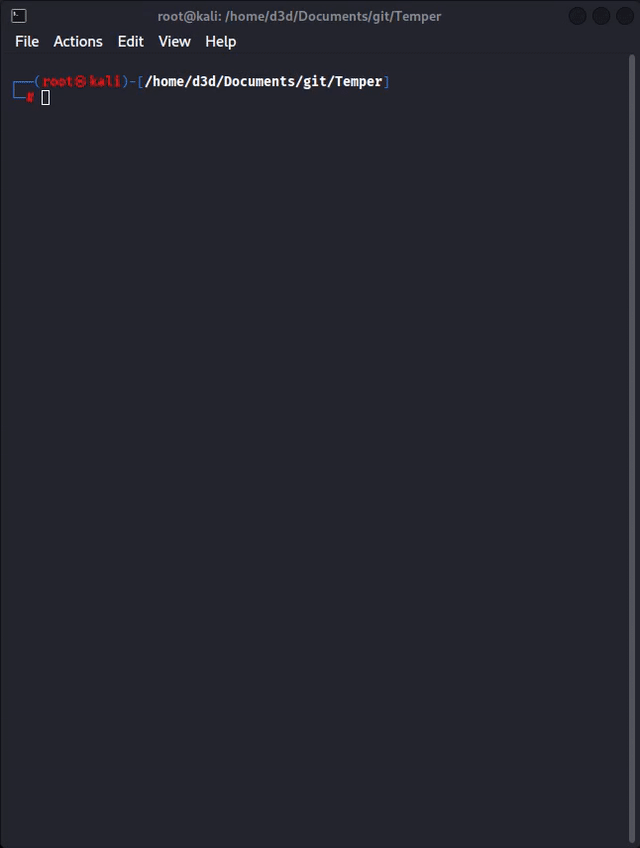

# Temper
Temper is an ARP scanner and sender written in Rust. It allows you to scan IP addresses in a network and send customizable ARP packets with adjustable packet count and delay between packets.
<p align="center">
  
</p>

## Features
- Scan IP addresses in a network.
- Send customizable ARP packets.
- Adjustable packet count and delay between packets.

## Installation

To get started with Temper, follow these steps:
```bash
git clone https://github.com/QwaBar4/Temper.git
cd Temper
cargo build
```
## Usage
Run the application with the following command:
```bash
./temper
```
Follow the on-screen menu to perform actions such as scanning IPs, choosing an IP to send packets, and adjusting packet settings.
### Contributing
If you want to contribute with me, text me on telegram: @QwaBar4
